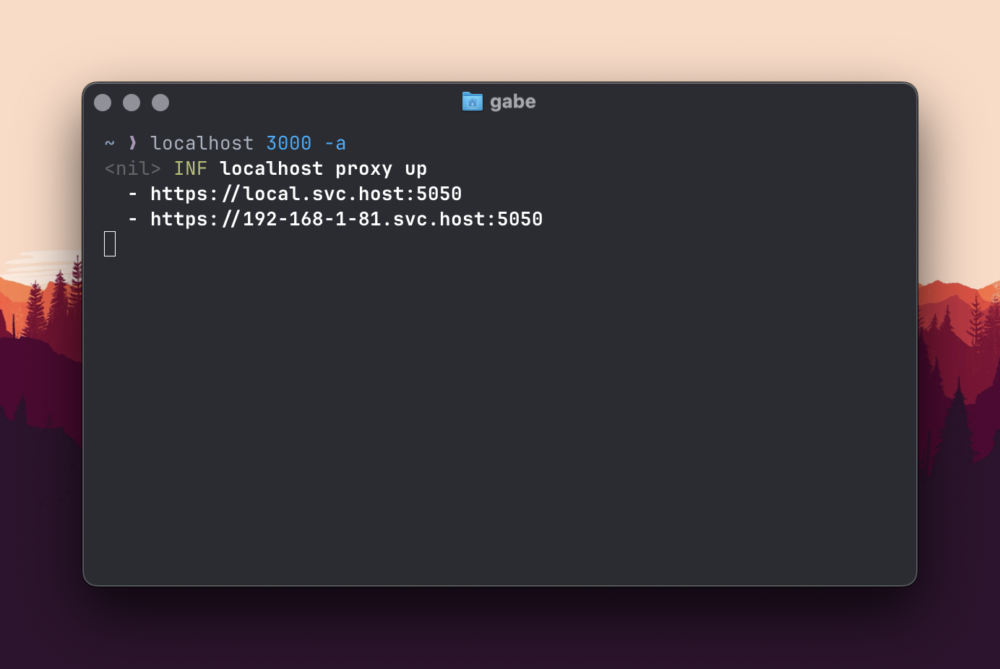

# localhost
    




Local development certs for LAN https services.

Localhost exposes local insecure http services as fully encrypted https available at `svc.host`

## Install

**Homebrew (auto updates)**  
```sh
brew install sprisa/tap/localhost   
```

**NPM**  
    


```sh
npx @sprisa/localhost 3000 -a
```

**Golang Source**  
With Go (Any platform — doesn't auto update)  

```sh
go install github.com/sprisa/localhost@latest
```

## Usage

#### Serve the service at port `3000`
```sh
localhost 3000
```

Navigate to the https service at [`https://local.svc.host:5050`](https://local.svc.host:5050)

#### Serve on all interfaces
```sh
localhost 3000 -a
```

#### Change the proxy port. Defaults to port `5050`
```sh
localhost 3000 -p 3001
```

[`https://local.svc.host:3001`](https://local.svc.host:3001)


#### Show Help
```sh
localhost --help
```

## Why?

#### 1. Many Javascript APIs are only available in [secure contexts](https://developer.mozilla.org/en-US/docs/Web/Security/Secure_Contexts) (aka https). This makes local development harder than it should be.
  - For example the [Crypto API](https://developer.mozilla.org/en-US/docs/Web/API/Web_Crypto_API). This list of restricted APIs is only [growing](https://developer.mozilla.org/en-US/docs/Web/Security/Secure_Contexts/features_restricted_to_secure_contexts).
  - Some browser contexts, like iOS Webviews, refuse to load insecure webpages.

#### 2. Easier mobile development (React Native)
  - iOS will not make api requests to insecure APIs (http) when the development app is running on a remote device.

#### 3. Remote development debugging
  - Localhost makes it easy to share your service on your Mesh Network IP.
  - Remote development without needing to be on the same LAN network when using a mesh network like `Priv Network` or `Tailscale`


## Whats is `svc.host`?  
`svc.host` is a DNS server which replies with your local WAN IP. It allows the https (tls) certificates to be trusted by your browser.

Hostnames are in the form `[ip-address].svc.host`, with the IP's dot seperator (`.`) being replaced with a dash (`-`) instead.
```
dig 192-168-1-180.svc.host => 192.168.1.180
dig 10-10-10-10.svc.host => 10.10.10.10
dig local.svc.host => 127.0.0.1
```

Only private IP ranges are supported.


### Inspiration

- localtls - https://github.com/Corollarium/localtls
- sslip.io - https://sslip.io/


### Public Internet Tunnels

`localhost` is not a tunnel for the public internet. It connects any devices that are already on the same subnet, such as LAN or a mesh VPN. If you need an internet tunnel check out [anderspitman/awesome-tunneling](https://github.com/anderspitman/awesome-tunneling).


